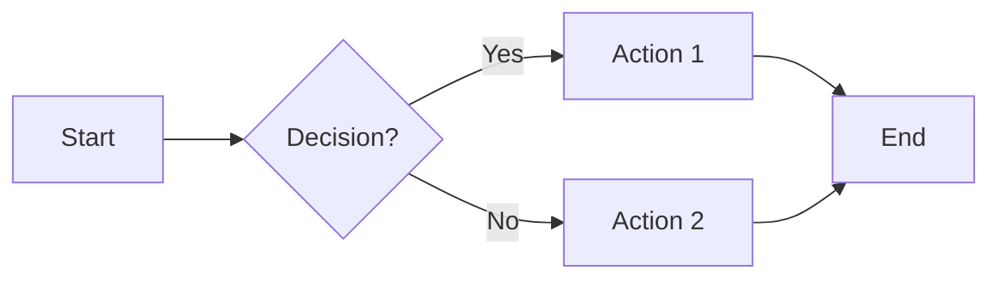

# Diagram and Flowchart Generator
## Supported Diagram Types
| Type | Best For | Syntax |
|------|----------|--------|
| Flowchart | Process flows, decision trees | Mermaid `flowchart LR` |
| Sequence | API calls, interactions | Mermaid `sequenceDiagram` |
| State | State machines, workflows | Mermaid `stateDiagram-v2` |
| Gantt | Project timelines | Mermaid `gantt` |
| ERD | Database schemas | Mermaid `erDiagram` |
| Class | Code architecture | Mermaid `classDiagram` |

## Mermaid Quick Reference

## Process
1. User describes the process/system in natural language
2. Claude selects the most appropriate diagram type
3. Claude generates Mermaid syntax
4. Claude explains any simplifications made
